<h1 align='center'>GitHub Stats Terminal Style</h1>
<p align='center'>Dynamically Generate GitHub Stats as like Terminal Interface </p>

<p align="center" >
  <a href="https://github.com/yogeshwaran01/github-stats-terminal-style/actions/workflows/main.yml">
    
  </a>
</p>

<p align='center'>
  
</p>

## Usage

1. Create a New Repository using this Template or click [here](https://github.com/yogeshwaran01/github-stats-terminal-style/generate) to create.
2. Create the personal Acess token. Checkout this [link](https://docs.github.com/en/github/authenticating-to-github/keeping-your-account-and-data-secure/creating-a-personal-access-token) to create personal access token.
3. Add a New Repository secret to your repo. Name of the secret is must be `GHT` and valve is your personal access token. Checkout this [link](https://docs.github.com/en/actions/reference/encrypted-secrets) to add new repositiry secret.

The File `github_stats.svg` is svg image of your github stats. you can copy the link of the image and use it any where. By default it update daily at `2:47 UTC` you can also can this by change the cron in `/.github/workflows/main.yml` by using [Cron Generator](https://crontab.guru/).

## Themes

Now only Nine themes are only available. By default, ubuntu theme. you can change the theme by change the command in file `/.github/workflows/main.yml`.

```bash
node updater.js ${{ github.repository_owner }} <themeName>
```

For random theme, need not to mention any arguments

|                           **Theme Sample**                            | **Theme Name** |         **Theme Sample**        |  **ThemeName** |
| :-------------------------------------------------------------------: | :------------: | :------------------------------:| :-------------: |
|            |     ubuntu     |   |   hacker   |
|                |      atom      |   |   googledark   |
|          |    default     |  |  googlelight   |
|          |    dracula     |      |    monokai     |
|            |     github     |   |   powershell   |

## Contributions

Contributions, issue and pull requests are welcome

## Credits

Svg Generated from [termtosvg](https://github.com/nbedos/termtosvg)
