<h1 align='center'>GitHub Stats Terminal Style</h1>

Dynamically Generate GitHub Stats as like Terminal Interface 

  

## Usage

Later

## Themes

Now only Nine themes are only available. you can change the theme by

- ubuntu
- dracula
- monokai
- atom
- github
- googledark
- googlelight
- powershell

Contributions, issue and pull requests are welcome

<h3 align='center'>Made With Python :heart:</h3>
